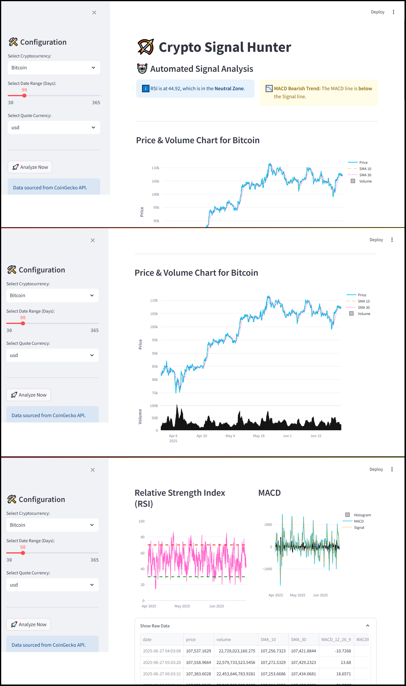

# 🏹 Crypto Signal Hunter v2.1

An interactive dashboard for cryptocurrency technical analysis, built with Python and Streamlit. This tool fetches live market data from the CoinGecko API, calculates key technical indicators, and generates automated trading signals.



## 📋 Prerequisites

Before you begin, ensure you have the following installed:

- **Python 3.12:** This project is tested and confirmed to work with Python 3.12.x. **Python 3.13 is not currently supported** due to dependency conflicts.
- **Git:** For cloning the repository.
- **(Windows Users):** Microsoft C++ Build Tools are required for compiling some dependencies. You can download them from [here](https://visualstudio.microsoft.com/visual-cpp-build-tools/).

## 🚀 Getting Started

You can set up and run this project in two ways: the easy way (using the provided scripts) or the manual way.

### The Easy Way (Recommended)

These scripts automate the entire setup and run process. Run them from your terminal (like Git Bash on Windows).

**1. Setup the Environment:**
This script will create a virtual environment and install all necessary dependencies.
```bash
./Setup.sh
```

(Note: You can pass your specific Python version, e.g., 3.12, as an argument.)
```bash
./Setup.sh 3.12
```

**2. Run the Application:**
Once the setup is complete, use this script to start the dashboard.
```bash
./Run.sh
```

### The Manual Way
If you prefer to set up the project manually, follow these steps.

**1. Clone the repository:**
```bash
git clone [https://github.com/Reyzen1/crypto-signal-hunter.git](https://github.com/Reyzen1/crypto-signal-hunter.git)
cd crypto-signal-hunter
```

**2. Create and activate a virtual environment:**
```bash
# Create a venv using Python 3.12
python3.12 -m venv venv

# Activate it
# On Windows (Git Bash or PowerShell)
source venv/Scripts/activate
# On macOS/Linux
source venv/bin/activate
```
**3. Install the required dependencies:**

```bash
pip install -r requirements.txt
```

4. Run the Streamlit app:

```bash
streamlit run app.py
```

The application should now open in your web browser!

## ✨ Features
- Interactive Dashboard: A clean and user-friendly web interface powered by Streamlit.
- Automated Setup: Includes Setup.sh and Run.sh scripts for easy environment configuration and execution.
- Key Technical Indicators: SMA, MACD, and RSI.
- Automated Signal Generation: Real-time alerts for RSI Overbought/Oversold conditions and MACD crossovers.
- Advanced Visualizations: Interactive charts built with Plotly.

## 🛠️ Tech Stack
- Language: Python 3.12
- Core Libraries:
    - Streamlit
    - Pandas
    - Plotly
    - Pandas TA
    - Requests
    - Numpy
    - Matplotlib